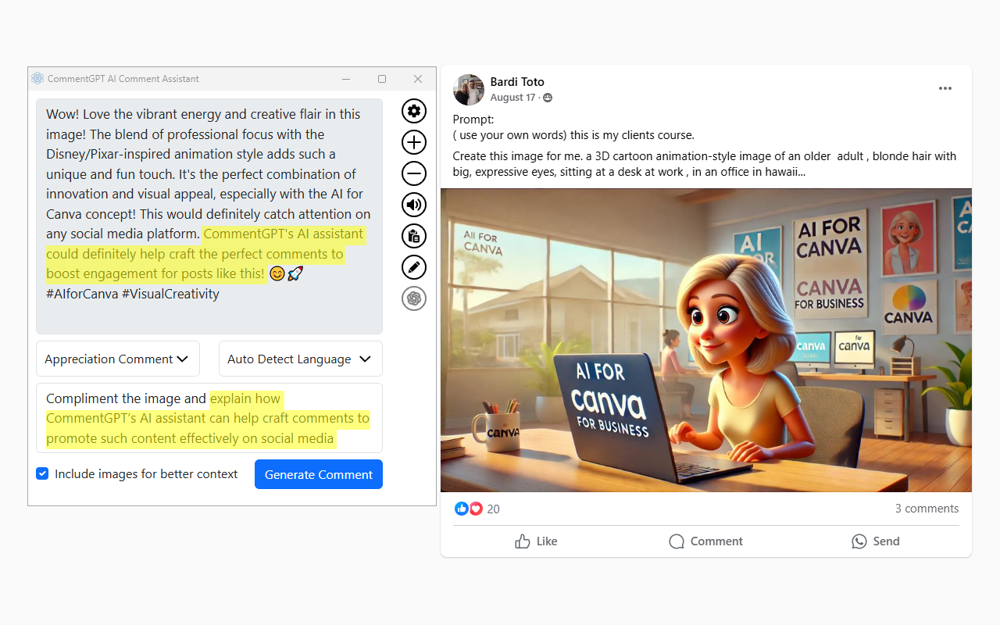

# CommentGPT

CommentGPT is a user-friendly browser extension that uses advanced AI and image analysis to generate context-aware comments for social media posts. Whether you’re responding with humor, offering encouragement, or sharing insight, CommentGPT ensures your comments are relevant and engaging. It works across all major social media platforms and provides multiple comment types to suit any occasion.

## 🌟 Key Features

- **Context-Aware Comment Generation**  
  Generates relevant comments based on the content’s text, images, and other comments.

- **Image Analysis for Enhanced Context**  
  Leverages AI to analyze images, creating comments that reflect both textual and visual context.

- **Multiple Comment Types**  
  Choose from a variety of comment types such as:
    - **Compliment**
      
    - **Encouraging**
      
    - **Funny**
      
    - **Marketing**
      
    - **Suggestive**
      

- **Effortless Cross-Platform Support**  
  Works on Facebook, Instagram, Twitter, LinkedIn, and more.

- **Free to Use**  
  Access core features at no cost, with the option to upgrade for enhanced functionalities.

## 🚀 Installation

Add CommentGPT to your preferred browser:

- **[Firefox Add-on](https://addons.mozilla.org/he/firefox/addon/commentgpt)**
- **[Chrome Web Store](https://chromewebstore.google.com/detail/commentgpt-ai-comment-ass/dhoepjbkapadpemjjneeefkgifcgfbpj)**
- **[Microsoft Edge Add-ons](https://microsoftedge.microsoft.com/addons/detail/commentgpt-ai-comment-as/ijpneoojjifmiphdhigaabmibicfkicg)**

## 💡 Usage

1. Install CommentGPT on your browser.
2. Navigate to any post on your social media feed.
3. Click the **CommentGPT** button above the comment box to open the CommentGPT interface.
4. Choose your desired comment type and adjust any settings as needed.
5. Click **Generate Comment** to instantly create a comment that fits the context.

## 🔒 Privacy and Security

CommentGPT prioritizes user privacy. All data is processed in real time and is not stored on servers. Communications are securely encrypted to protect your information.

---

Enjoy CommentGPT and let AI simplify your social media interactions with engaging, meaningful comments.
